# Lab 04: MFA, Conditional Access and AAD Identity Protection

## Lab scenario
You have been asked to create a proof of concept of features that enhance Azure Active Directory (Azure AD) authentication. Specifically, you want to evaluate:
- Azure AD multi-factor authentication
- Azure AD conditional access
- Azure AD Identity Protection

## Lab Objectives
In this lab, you will complete the following exercises:
- Exercise 1: Deploy an Azure VM by using an Azure Resource Manager template
- Exercise 2: Implement Azure MFA
- Exercise 3: Implement Azure AD Conditional Access Policies 
- Exercise 4: Implement Azure AD Identity Protection

## Architecture Diagram

## Lab files:

- **C:\\AllFiles\\AZ500-AzureSecurityTechnologies-prod\\Allfiles\\Labs\04\\az-500-04_azuredeploy.json**
- **C:\\AllFiles\\AZ500-AzureSecurityTechnologies-prod\\Allfiles\\Labs\04\\az-500-04_azuredeploy.parameters.json** 

## Exercise 1: Deploy an Azure VM by using an Azure Resource Manager template

### Estimated timing: 10 minutes

In this exercise, you will complete the following tasks:

- Task 1: Deploy an Azure VM by using an Azure Resource Manager template.

### Task 1: Deploy an Azure VM by using an Azure Resource Manager template

In this task, you will create a virtual machine by using an ARM template. This virtual machine will be used in the last exercise for this lab. 

1. In the Azure portal, in the **Search resources, services, and docs** text box at the top of the Azure portal page, type **custom template** and select **Deploy a custom template** under the list of **Services**.

    >**Note**: You can also select **Template Deployment (deploy using custom templates)** from the **Marketplace** list.

2. On the **Custom deployment** blade, click on the **Build your own template in the editor** option.

3. On the **Edit template** blade, click on **Load file**, locate the **C:\\AllFiles\\AZ500-AzureSecurityTechnologies-prod\\Allfiles\\Labs\04\\az-500-04_azuredeploy.json** file and click on **Open**.

    >**Note**: Review the content of the template and note that it deploys an Azure VM hosting Windows Server 2019 Datacenter.

4. On the **Edit template** blade, click on **Save**.

5. Back on the **Custom deployment** blade, click on **Edit parameters**.

6. On the **Edit parameters** blade, click on **Load file**, locate the **C:\\AllFiles\\AZ500-AzureSecurityTechnologies-prod\\Allfiles\\Labs\04\\az-500-04_azuredeploy.parameters.json** file and click on **Open**.

    >**Note**: Review the content of the parameters file noting the adminUsername and adminPassword values.

7. On the **Edit parameters** blade, click on **Save**.

8. On the **Custom deployment** blade, ensure that the following settings are configured (leave any others with their default values):

   |Setting|Value|
   |---|---|
   |Subscription|the name of the Azure subscription you will be using in this lab|
   |Resource group|click on **Create new** and type the name **AZ500LAB04**|
   |Location|**(US) East US**|
   |Vm Size|**Standard_D2s_v3**|
   |Vm Name|**az500-04-vm1**|
   |Admin Username|**Student**|
   |Admin Password|**Pa55w.rd1234**|
   |Virtual Network Name|**az500-04-vnet1**|

    >**Note**: To identify Azure regions where you can provision Azure VMs, refer to [**https://azure.microsoft.com/en-us/regions/offers/**](https://azure.microsoft.com/en-us/regions/offers/)

9. Click on **Review + create**, and then click on **Create**.

    >**Note**: Do not wait for the deployment to complete but proceed to the next exercise. You will use the virtual machine included in this deployment in the last exercise of this lab.

> Result: You have initiated a template deployment of an Azure VM **az500-04-vm1** that you will use in the last exercise of this lab.

## Exercise 2: Implement Azure MFA

### Estimated timing: 30 minutes

In this exercise, you will complete the following tasks

- Task 1: Create a new Azure AD tenant.
- Task 2: Activate the Azure AD Premium P2 trial.
- Task 3: Create Azure AD users and groups.
- Task 4: Assign Azure AD Premium P2 licenses to Azure AD users.
- Task 5: Configure Azure MFA settings.
- Task 6: Validate MFA configuration

### Task 1: Create a new Azure AD tenant

In this task, you will create a new Azure AD tenant. 

1. In the Azure portal, in the **Search resources, services, and docs** text box at the top of the Azure portal page, type **Azure Active Directory** and press the **Enter** key.

2. On the blade displaying **Overview** of your current Azure AD tenant, click on **Manage tenants**, and then on the next screen, click on **+ Create**.

3. On the **Basics** tab of the **Create a tenant** blade, ensure that the option **Azure Active Directory** is selected and click on **Next: Configuration >**.

4. On the **Configuration** tab of the **Create a tenant** blade, specify the following settings:

   |Setting|Value|
   |---|---|
   |Organization name|**AdatumLab500-04**|
   |Initial domain name|a unique name consisting of a combination of letters and digits|
   |Country or region|**United States**|

    >**Note**: Record the initial domain name. You will need it later in this lab.

5. Click on **Review + Create** and then click on **Create**.

6. Add Captcha code on **Help us prove you're not a robot** blade and then click on **Submit** button.

    >**Note**: Wait for the new tenant to be created. Use the **Notification** icon to monitor the deployment status. 

### Task 2: Activate Azure AD Premium P2 trial

In this task, you will sign up for the Azure AD Premium P2 free trial. 

1. In the Azure portal, in the toolbar, click on the **Directories + subscriptions** icon, located to the right of the Cloud Shell icon. 

2. In the **Directories + subscriptions** blade, click on the newly created tenant, **AdatumLab500-04** and click on the **Switch** button to set it as the current directory.

    >**Note**: You may need to refresh the browser window if the **AdatumLab500-04** entry does not appear in the **Directories + subscriptions** filter list.

3. In the Azure portal, in the **Search resources, services, and docs** text box at the top of the Azure portal page, type **Azure Active Directory** and press the **Enter** key. On the **AdatumLab500-04** blade, in the **Manage** section, click on **Licenses**.

4. On the **Licenses \| Overview** blade, in the **Manage** section, click on **All products** and then click on **+ Try / Buy**.

5. On the **Activate** blade, in the **Azure AD Premium P2** section, click on **Free Trial** and then click on **Activate**.

   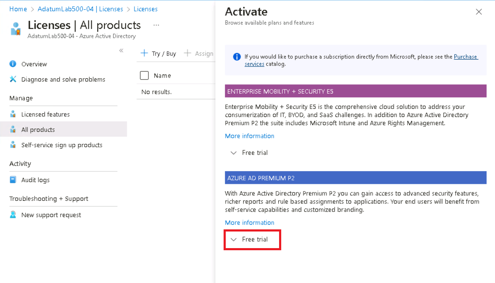

### Task 3: Create Azure AD users and groups.

In this task, you will create three users: aaduser1 (Global Admin), aaduser2 (user), and aaduser3 (user). You will need each user's principal name and password for later tasks. 

1. Navigate back to the **AdatumLab500-04** Azure Active Directory blade and, from left navigation pane under the **Manage** section, click on **Users**.

2. On the **Users** blade, click on **+ New User** and then from the drop-down menu select **Create new user**.

3. On **Create new user** blade,  under **Basics** tab specify the following settings (leave all others with their default values) and click on **Next:Properties>**

   |Setting|Value|
   |---|---|
   |User principal name|**aaduser1**|
   |Display name|**aaduser1**|
   |Password|ensure that the option **Auto-generate password** is selected|
   
   >**Note**: Record the full user name. You can copy its value by clicking the **Copy to clipboard** button on the right hand side of the drop-down list displaying the domain name. 

   >**Note**: Record the user's password. You will need this later in this lab. 

3. On **Create new user** blade, under **Properties** tab   specify Usage Location as **United States** and  click on **Next:Assignments>** 

3. On **Create new user** blade, under **Assignments** tab  click **+ Add role** and on Directory roles search for **Global administrator** click select.

4. click on **Review + Create** and **Create**

4. Back on the **Users \| All users** blade, click on **+ New User** and then from the drop-down menu select **Create new user**. 

3. On **Create new user** blade,  under **Basics** tab specify the following settings (leave all others with their default values) and click on **Next:Properties>**

   |Setting|Value|
   |---|---|
   |User principal name|**aaduser2**|
   |Display name|**aaduser2**|
   |Password|ensure that the option **Auto-generate password** is selected |
   
    >**Note**: Record the full user name. You can copy its value by clicking the **Copy to clipboard** button on the right hand side of the drop-down list displaying the domain name. 

   >**Note**: Record the user's password. You will need this later in this lab. 

3. On **Create new user** blade, under **Properties** tab, specify Usage Location as **United States**.

4. click on **Review + Create** and **Create**.
  
6. Back on the **Users \| All users** blade, click on **+ New User** and then from the drop-down menu select **Create new user**. 

3. On **Create new user** blade,  under **Basics** tab specify the following settings (leave all others with their default values) and click on **Next:Properties>**

   |Setting|Value|
   |---|---|
   |User principal name|**aaduser3**|
   |Display name|**aaduser3**|
   |Password|ensure that the option **Auto-generate password** is selected |
   
    >**Note**: Record the full user name. You can copy its value by clicking the **Copy to clipboard** button on the right hand side of the drop-down list displaying the domain name. 

   >**Note**: Record the user's password. You will need this later in this lab. 

3. On **Create new user** blade, under **Properties** tab, specify Usage Location as **United States**.

4. click on **Review + Create** and **Create**.
   
    >**Note**: At this point, you should have three new users listed on the **Users** page. 
	
### Task 4: Assign Azure AD Premium P2 licenses to Azure AD users

In this task, you will assign each user to the Azure Active Directory Premium P2 license.

1. On the **Users** blade, click on the entry representing your user account. 

2. On the blade displaying the properties of your user account, click on **Edit properties**. 

3. In the **Settings** section, in the **Usage location** drop-down list, select the **United States** entry and click on **Save**.

4. Navigate back to the **AdatumLab500-04** Azure Active Directory blade and, from left navigation pane under the **Manage** section, click on **Licenses**.

5. On the **Licenses \| Overview** blade, from left navigation pane click on **All products**, select the **Azure Active Directory Premium P2** checkbox, and click on **+ Assign**.

6. On the **Assign license** blade, click on **+ Add users and groups**.

7. On the **Add users and groups** blade, select **aaduser1**, **aaduser2**, **aaduser3**, and your user account and click on **Select**.

8. Back on the **Assign license** blade, click on **Assignment options**, ensure that all options are enabled(on), click on **Review + assign**, and click on **Assign**.

9. Sign out from the Azure portal and sign back in using the same account. This step is necessary for the license assignment to take effect.

    >**Note**: At this point, you assigned Azure Active Directory Premium P2 licenses to all user accounts you will be using in this lab. Be sure to sign out and then sign back in. 

### Task 5: Configure Azure MFA settings.

In this task, you will configure MFA and enable MFA for aaduser1. 

1. In the Azure portal, navigate back to the **AdatumLab500-04** Azure Active Directory tenant blade.

    >**Note**: Make sure you are using the AdatumLab500-04 Azure AD tenant.

2. On the **AdatumLab500-04** Azure Active Directory tenant blade, in the **Manage** section, click on **Security**.

3. On the **Security \| Getting started** blade, in the **Manage** section, click on **Multifactor authentication**.

4. On the **Multi-Factor Authentication \| Getting started** blade, click on the **Additional cloud-based Multifactor authentication settings** link. 

    >**Note**: This will open a new browser tab, displaying **multi-factor authentication** page.

5. On the **multi-factor authentication** page, click on the **service settings (1) ** tab. Review **verification options (2)**. Note that **Text message to phone**, **Notification through mobile app**, and **Verification code from mobile app or hardware token** are enabled. Click on **Save** and then click on **close**.

    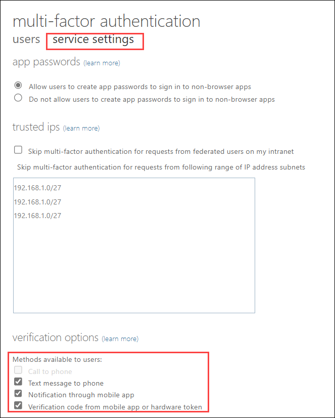

6. On the **AdatumLab500-04 \| Overview** page, switch to the **users (1)** tab

    >**Note**: This will open a new browser tab, displaying **multi-factor authentication** page. 
    
7. Click on **aaduser1 (2)** entry, then click on the **Enable (3)** link on the right-side, and, when prompted, click on **enable multi-factor auth**.

    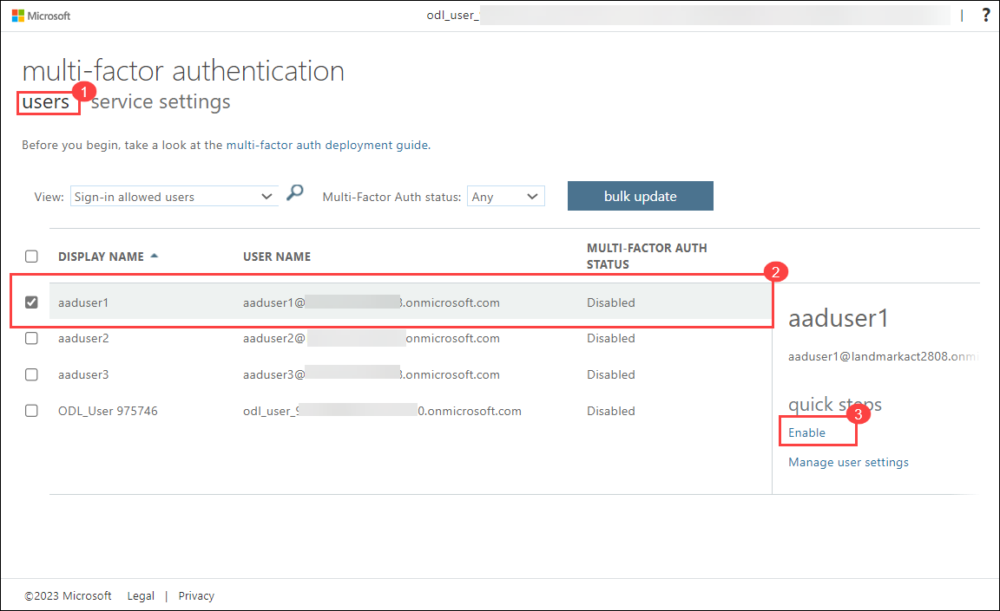

7. Notice the **Multi-Factor Auth status** column for **aaduser1** is now **Enabled**.

8. Again click on **aaduser1** and notice that, at this point, you also have the **Enforce** option on the right-side. 

    >**Note**: Changing the user status from Enabled to Enforced impacts only legacy Azure AD integrated apps which do not support Azure MFA and, once the status changes to Enforced, require the use of app passwords.

9. Again with the **aaduser1** entry selected, click on **Manage user settings** and review the available options: 

   - Require selected users to provide contact methods again.

   - Delete all existing app passwords generated by the selected users.

   - Restore multi-factor authentication on all remembered devices.

10. Click on **Cancel**.

11. In the Azure portal, in the **Search resources, services, and docs text box** at the top of the Azure portal page, type **Multifactor Authentication** and press the Enter key. On the **Multifactor Authentication | Getting started** blade.

12. From left navigation pane under **Settings** section, click on **Fraud alert**.

13. On the **Multi-Factor Authentication \| Fraud alert** blade, configure the following settings:

     |Setting|Value|
     |---|---|
     |Allow users to submit fraud alerts|**On**|
     |Automatically block users who report fraud|**On**|
     |Code to report fraud during initial greeting|**0**|

14. Click on **Save**

    >**Note**: At this point, you have enabled MFA for aaduser1 and setup fraud alert settings. 

15. Navigate back to the **AdatumLab500-04** Azure Active Directory tenant blade, in the **Manage** section, click on **Properties**, next click on the **Manage Security defaults** link at the bottom of the blade,

16. On the **Security Defaults** blade, click on **Disable**, select **My Organization is using Conditonal Access** as the reason and and then click on **Save**.

    >**Note**: Ensure that you are signed-in to the **AdatumLab500-04** Azure AD tenant. You can use the **Directories + subscriptions** filter to switch between Azure AD tenants. Ensure you are signed in as a user with the Global Administrator role in the Azure AD tenant.

### Task 6: Validate MFA configuration

In this task, you will validate the MFA configuration by testing the sign in of the aaduser1 user account. 

1. Open an InPrivate browser window.

2. Navigate to the Azure portal and sign in using the **aaduser1** user account. 

    >**Note**: To sign in you will need to provide a fully qualified name of the **aaduser1** user account, including the Azure AD tenant DNS domain name, which you recorded earlier in this lab. This user name is in the format aaduser1@`<your_tenant_name>`.onmicrosoft.com, where `<your_tenant_name>` is the placeholder representing your unique Azure AD tenant name. 

3. When prompted, in the **More information required** dialog box, click on **Next**.

    >**Note**: The browser session will be redirected to the **Additional security verification** page.

4. On the **Keep your account secure** page, select the **I want to set up a different method** link, in the **Which method would you like to use?** drop-down list, select **Phone**, and select **Confirm**.

5. On the **Keep your account secure** page, select your country or region, type your mobile phone number in the **Enter phone number** area, ensure that the **Text me a code** option is selected, and click on **Next**.
 
6. On the **Keep your account secure** page, type the code you received in the text message on your mobile phone, and click on **Next**.

7. On the **Keep your account secure** page, ensure that the verification was successful and click on **Next** and then click on **Done**.

8. When prompted, change your password. Make sure to record the new password.

9. Verify that you successfully signed in to the Azure portal.

10. Sign out as **aaduser1** and close the InPrivate browser window.

> Result: You have created a new AD tenant, configured AD users, configured MFA, and tested the MFA experience for a user. 

## Exercise 3: Implement Azure AD Conditional Access Policies 

### Estimated timing: 15 minutes

In this exercise, you will complete the following tasks 

- Task 1: Configure a conditional access policy.
- Task 2: Test the conditional access policy.

### Task 1 - Configure a conditional access policy. 

In this task, you will review conditional access policy settings and create a policy that requires MFA when signing in to the Azure portal. 

1. In the Azure portal, navigate back to the **AdatumLab500-04** Azure Active Directory tenant blade.

2. On the **AdatumLab500-04** blade, in the **Manage** section, click on **Security**.

3. On the **Security \| Getting started** blade, in the **Protect** section, click on **Conditional Access**.

4. On the **Conditional Access \| Overview** blade, click on **+ Create new policy**.

5. On the **New** blade, configure the following settings:

   - In the **Name** text box, type **AZ500Policy1**
	
   - Under Users, click on **0 Users or groups selected**. On the right side under Include >> Select users and groups checkbox >> enable **Users and groups** checkbox >> on the **Select** blade, click on **aaduser2**, and click on **Select**.
	
   - Under **Cloud apps or actions**, click on **No cloud apps, actions, or authentication contexts selected**. On the right side under Include >> click on **Select apps** checkbox >> under Select, click on None >> on the **Select** blade, click on **Microsoft Azure Management**, and click on **Select**.

      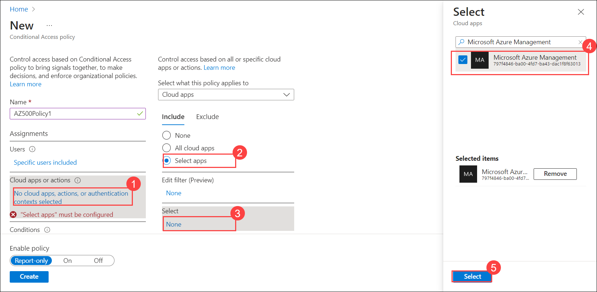
    
   >**Note**: Review the warning that this policy impacts access to the Azure Portal.
	
   - Under **Conditions**, click on **0 conditions selected**. On the right side under **Sign-in risk**, click on **Not configured** >> on the **Sign-in risk** blade, review the risk levels but do not make any changes and close the **Sign-in risk** blade.

      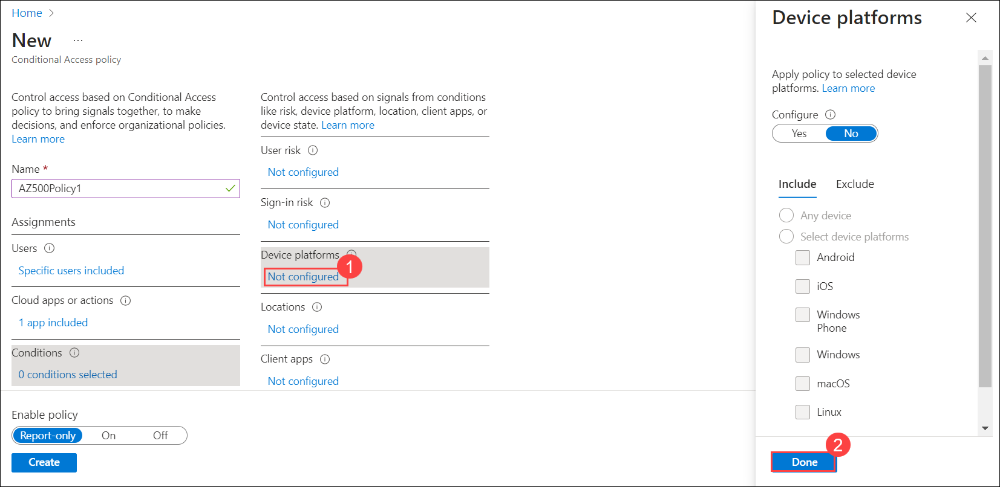
	
   - Under **Device platforms**, click on **Not configured** >> review the device platforms that can be included and click on **Done**.

      
	
   - Under **Locations**, click on **Not configured** >> review the location options without making any changes.
	
   - Under **Grant**, click on **0 controls selected** in the **Access controls** section, on the **Grant** blade, select the **Require multifactor authentication** checkbox and click on **Select**.
   
	 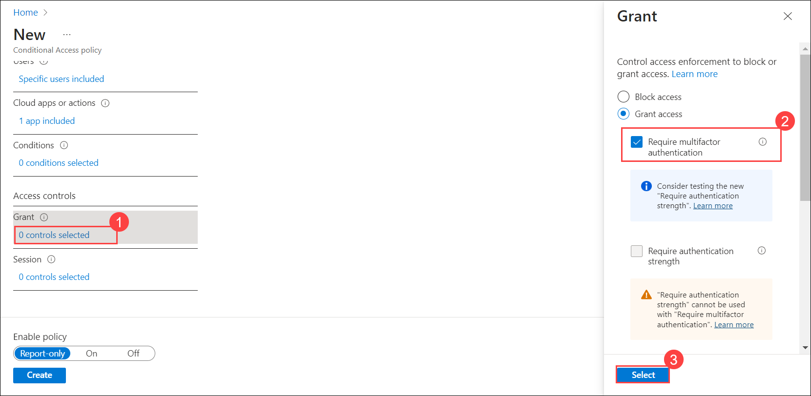
	 
   - Set the **Policy enforcement** to **Enable**.

        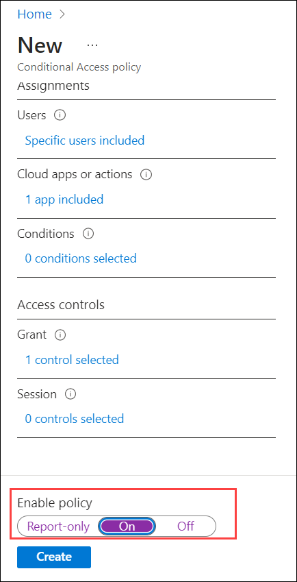
 
 6. On the **New** blade, click on **Create**. 

    >**Note**: At this point, you have a conditional access policy that requires MFA to sign in to the Azure portal. 

### Task 2 - Test the conditional access policy.

In this task, you will sign in to the Azure portal as **aaduser2** and verify MFA is required. You will also delete the policy before continuing to the next exercise. 

1. Open an InPrivate Microsoft Edge window.

2. In the new browser window, navigate to the Azure portal and sign in with the **aaduser2** user account.

3. When prompted, in the **More information required** dialog box, click on **Next**.

    >**Note**: The browser session will be redirected to the **Keep your account secure** page.
    
4. On the **Keep your account secure** page, select the **I want to set up a different method** link, in the **Which method would you like to use?** drop-down list, select **Phone**, and select **Confirm**.

5. On the **Keep your account secure** page, select your country or region, type your mobile phone number in the **Enter phone number** area, ensure that the **Text me a code** option is selected, and click on **Next**.

6. On the **Keep your account secure** page, type the code you received in the text message on your mobile phone, and click on **Next**.

7. On the **Keep your account secure** page, ensure that the verification was successful and click on **Next**.

8. On the **Keep your account secure** page, click on **Done**.

9. When prompted, change your password. Make sure to record the new password.

10. Verify that you successfully signed in to the Azure portal.

11. Sign out as **aaduser2** and close the InPrivate browser window.

    >**Note**: You have now verified that the newly created conditional access policy enforces MFA when aaduser2 signs into the Azure portal.

12. Back in the browser window displaying the Azure portal, navigate back to the **AdatumLab500-04** Azure Active Directory tenant blade.

13. On the **AdatumLab500-04** blade, in the **Manage** section, click on **Security**.

14. On the **Security \| Getting started** blade, in the **Protect** section, click on **Conditional Access**.

15. On the **Conditional Access \| Overview** blade, from left navigation pane select **Policies** click on the ellipsis next to **AZ500Policy1**, click on **Delete**, and, when prompted to confirm, click on **Yes**.

    >**Note**: Result: In this exercise you implement a conditional access policy to require MFA when a user signs into the Azure portal. 

>Result: You have configured and tested Azure AD conditional access.

## Exercise 4: Implement Azure AD Identity Protection

### Estimated timing: 30 minutes

In this exercise, you will complete the following tasks 

- Task 1: View Azure AD Identity Protection options in the Azure portal
- Task 2: Configure a user risk policy
- Task 3: Configure a sign-in risk policy
- Task 4: Simulate risk events against the Azure AD Identity Protection policies 
- Task 5: Review the Azure AD Identity Protection reports

### Task 1: Enable Azure AD Identity Protection

In this task, you will view the Azure AD Identity Protection options in the Azure portal. 

1. If needed, sign-in to the Azure portal **`https://portal.azure.com/`**.

    >**Note**: Ensure that you are signed-in to the **AdatumLab500-04** Azure AD tenant. You can use the **Directory + subscription** filter to switch between Azure AD tenants. Ensure you are signed in as a user with the Global Administrator role in the Azure AD tenant.

2. On the **AdatumLab500-04** blade, in the **Manage** section, click on **Security**.

3. On the **Security \| Getting started** blade, from left navigation pane under **Protect** section, click on **Identity Protection**.

4. On the **Identity Protection \| Overview** blade, review the **New risky users detected** and **New risky sign-ins detected** charts and other information about risky users.  

### Task 2: Configure a user risk policy

In this task, you will create a user risk policy. 

1. On the **Identity Protection \| Overview** blade, in the **Protect** section, click on **user risk policy**.

2. Configure the **User risk remediation policy** with the following settings: 

   - Under Users click on **All Users**; on the **Include** tab of the **Users** blade, ensure that the **All users** option is selected.

   - On the **Users** blade, switch to the **Exclude** tab, click on **Select excluded users**, select your user account, and then click on **Select**. 

     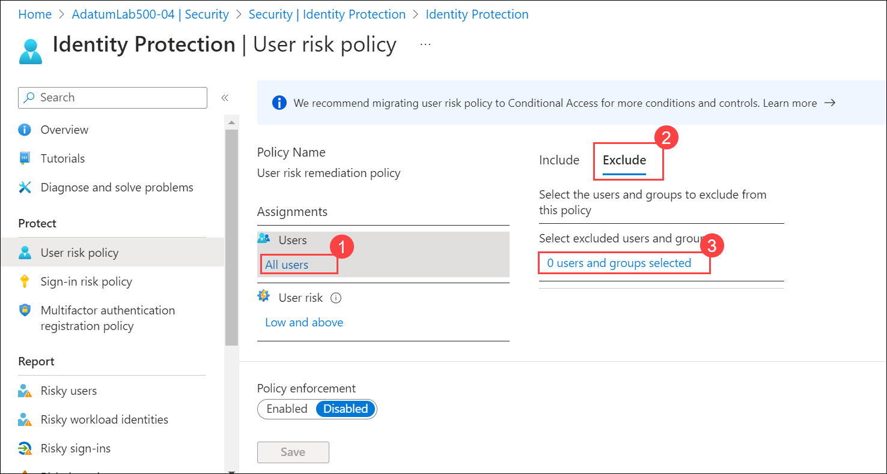
     
   - Under User risk click on **User risk**; on the **User risk** blade, select **Low and above**, and then click on **Done**. 
   
       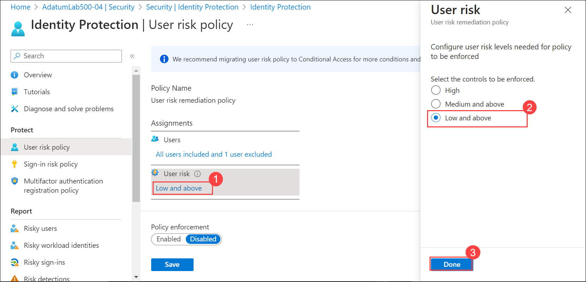

   - Under Access click on **Block access**; on the **Access** blade, ensure that the **Allow access** option and the **Require password change** checkbox are selected and click on **Done**.

       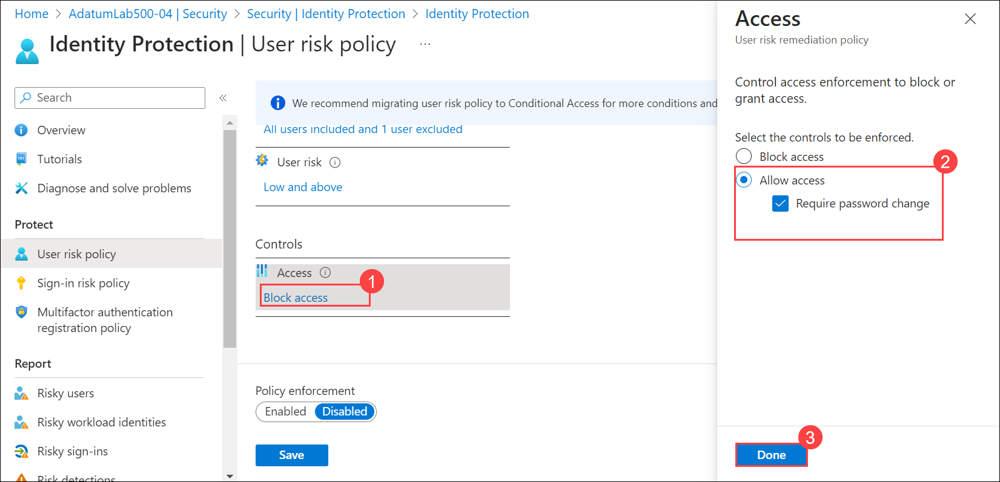

   - Set **Policy Enforcement** to **Enable** and click on **Save**.

### Task 3: Configure sign-in risk policy

In this task, you will configure a sign-in risk policy. 

1. On the **Identity Protection \| User risk policy** blade, in the **Protect** section, click on **Sign-in risk policy**.

2. Configure the **Sign-in risk remediation policy** with the following settings: 

   - Under Users click on **All Users**; on the **Include** tab of the **Users** blade, ensure that the **All users** option is selected.

   - Under Sign-in risk click on **Sign-in risk**; on the **Sign-in risk** blade, select **Medium and above**, and then click on **Done**. 

   - Under Access click on **Block access**; on the **Access** blade, ensure that the **Allow access** option and the **Require multi-factor authentication** checkbox are selected and click **Done**.

     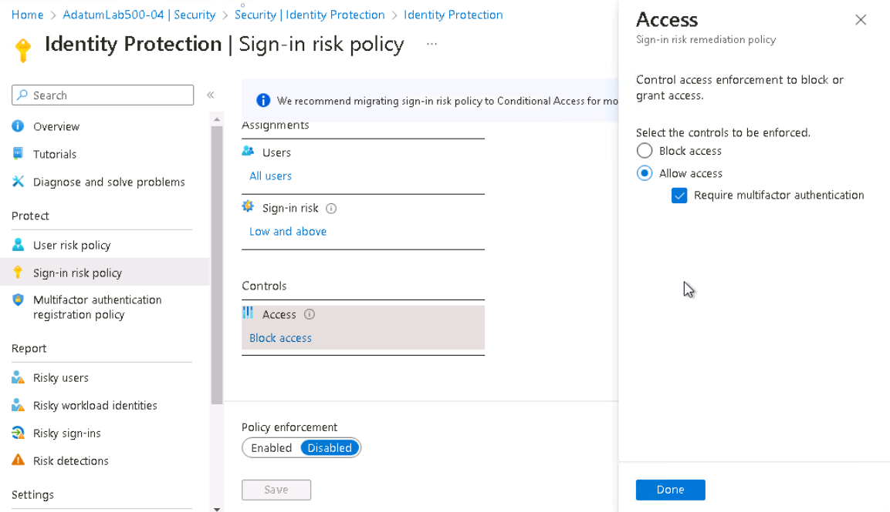

   - Set **Policy Enforcement** to **Enable** and click on **Save**.

### Task 4: Simulate risk events against the Azure AD Identity Protection policies 

> Before you start this task, ensure that the template deployment you started in Exercise 1 has completed. The deployment includes an Azure VM named **az500-04-vm1**. 

1. In the Azure portal, set the **Directory + subscription** filter to the Azure AD tenant associated with the Azure subscription into which you deployed the **az500-04-vm1** Azure VM.

2. In the Azure portal, in the **Search resources, services, and docs** text box at the top of the Azure portal page, type **Virtual machines** and press the **Enter** key.

3. On the **Virtual machines** blade, click on the **az500-04-vm1** entry. 

4. On the **az500-04-vm1** blade, click on **Connect** and, in the drop-down menu, click on **RDP**. 
   
   

5. Click on **Download RDP File** and use it to connect to the **az500-04-vm1** Azure VM via Remote Desktop. When prompted to authenticate, provide the following credentials:
   
   |Setting|Value|
   |---|---|
   |User name|**Student**|
   |Password|**Pa55w.rd1234**|

    >**Note**: Wait for the Remote Desktop session and **Server Manager** to load.  

    >**Note**: The following steps are performed in the Remote Desktop session to the **az500-04-vm1** Azure VM. 

6. In **Server Manager**, click on **Local Server** and then click on **IE Enhanced Security Configuration**.

7. In the **Internet Explorer Enhanced Security Configuration** dialog box, set both options to **Off** and click on **OK**.

8. Start **Internet Explorer**, click the cog wheel icon in the toolbar, in the drop-down menu, click on **Safety** and then click on **InPrivate Browsing**.

9. In the InPrivate Internet Explorer window, navigate to the ToR Browser Project at [**https://www.torproject.org/projects/torbrowser.html.en**](https://www.torproject.org/projects/torbrowser.html.en).

10. Download and install the Windows version of the ToR Browser with the default settings. 

11. Once the installation completes, start the ToR Browser, use the **Connect** option on the initial page, and browse to the Application Access Panel at [**https://myapps.microsoft.com**](https://myapps.microsoft.com).

12. When prompted, attempt to sign in with the **aaduser3** account. 

    >**Note**: You will be presented with the message **Your sign-in was blocked**. This is expected, since this account is not configured with multi-factor authentication, which is required due to increased sign-in risk associated with the use of ToR Browser.

13. Use the **Sign out and sign in with a different account option** to sign in as **aaduser1** account you created and configured for multi-factor authentication earlier in this lab.

    >**Note**: This time, you will be presented with the **Suspicious activity detected** message. Again, this is expected, since this account is configured with multi-factor authentication. Considering the increased sign-in risk associated with the use of ToR Browser, you will have to use multi-factor authentication.

14. Use the **Verify** option and specify whether you want to verify your identity via text or a call.

15. Complete the verification and ensure that you successfully signed in to the Application Access Panel.

16. Close your RDP session. 

    >**Note**: At this point, you attempted two different sign ins. Next, you will review the Azure Identity Protection reports.

### Task 5: Review the Azure AD Identity Protection reports

In this task, you will review the Azure AD Identity Protection reports generated from the ToR browser logins.

1. Back in the Azure portal, use the **Directory + subscription** filter to switch to the **AdatumLab500-04** Azure Active Directory tenant.

2. On the **AdatumLab500-04** blade, in the **Manage** section, click on **Security**.

3. On the **Security \| Getting started** blade, in the **Reports** section, click on **Risky users**. 

4. Review the report and identify any entries referencing the **aaduser3** user account.

5. On the **Security \| Getting started** blade, in the **Reports** section, click on **Risky sign-ins**. 

6. Review the report and identify any entries corresponding to the sign-in with the **aaduser3** user account.

7. Under **Reports** click on **Risk detections**.

8. Review the report and identify any entries representing the sign-in from an anonymous IP address generated by the ToR browser. 

 >**Note**: It may take 10-15 minutes to risks to show up in reports.

> **Result**: You have enabled Azure AD Identity Protection, configured user risk policy and sign-in risk policy, as well as validated Azure AD Identity Protection configuration by simulating risk events.

> **Congratulations** on completing the task! Now, it's time to validate it. Here are the steps:
> - Click the Lab Validation icon located at the upper right corner of the lab guide section which navigates to the Lab Validation Page.
> - Hit the Validate button for the corresponding task.If you receive a success message, you can proceed to the next task. 
> - If not, carefully read the error message and retry the step, following the instructions in the lab guide.
> - If you need any assistance, please contact us at labs-support@spektrasystems.com. We are available 24/7 to help you out.

**You have successfully completed the lab. Please click on next to go to the next lab.**
