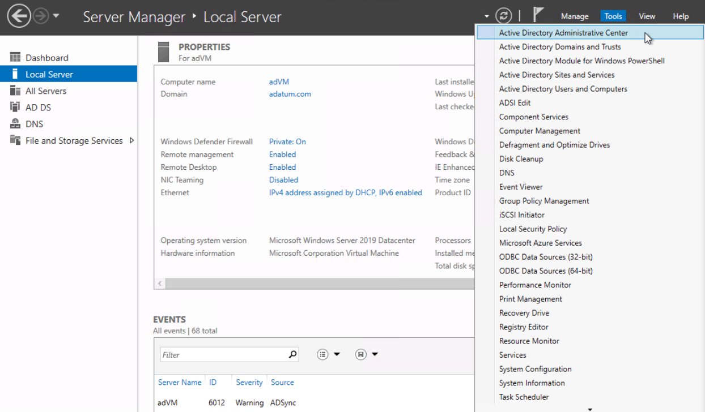
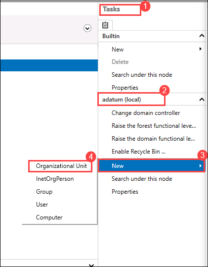
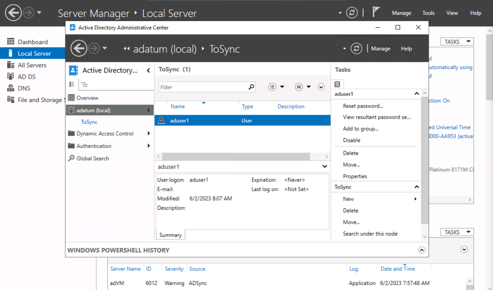
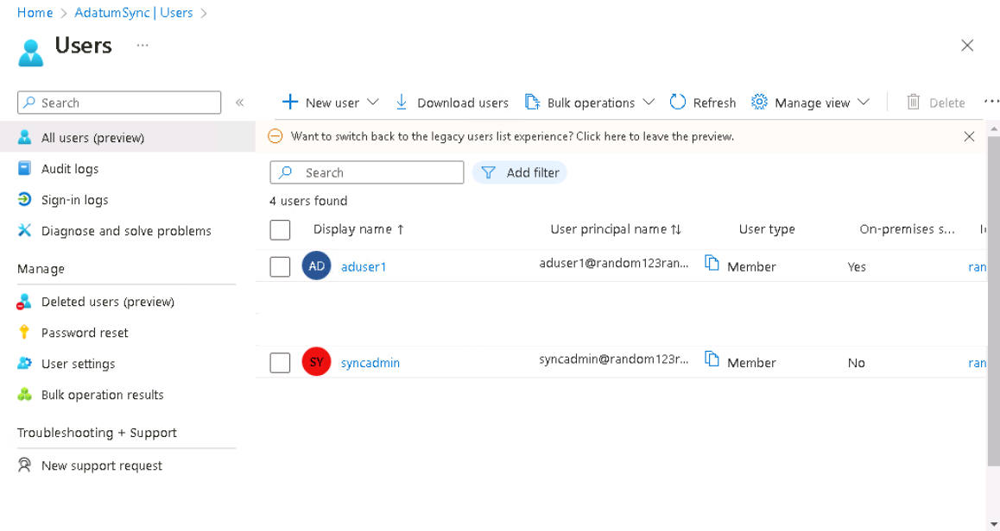

# Lab 06: Implement Directory Synchronization

## Lab scenario
You have been asked to create a proof of concept demonstrating how to integrate the on-premises Active Directory Domain Services (AD DS) environment with an Azure Active Directory (Azure AD) tenant. Specifically, you want to:
- Implement a single-domain AD DS forest by deploying an Azure VM hosting an AD DS domain controller
- Create and configure an Azure AD tenant
- Synchronize the AD DS forest with the Azure AD tenant

## Lab objectives
In this lab, you will complete the following exercises:
- Exercise 1: Deploy an Azure VM hosting an Active Directory domain controller
- Exercise 2: Create and configure an Azure Active Directory tenant
- Exercise 3: Synchronize Active Directory forest with an Azure Active Directory tenant

## Architecture Diagram


## Exercise 1: Deploy an Azure VM hosting an Active Directory domain controller

### Estimated timing: 10 minutes

In this exercise, you will complete the following tasks:

- Task 1: Identify an available DNS name for an Azure VM deployment
- Task 2: Use an ARM template to deploy an Azure VM hosting an Active Directory domain controller

### Task 1: Identify an available DNS name for an Azure VM deployment

In this task, you will identify a DNS name for your Azure VM deployment.

1. Ensure that you are signed-in to the **AdatumLab500-04** Azure AD tenant. You can use the **Directory + subscription** filter to switch between Azure AD tenants. Ensure you are signed in as a user with the Global Administrator role.
    
    >**Note**: If you still don't see the AdatumLab500-04 entry, click on the Switch Directory link, select the AdatumLab500-04 line and click the Switch button.

1. Open the Cloud Shell by clicking the first icon in the top right of the Azure Portal. If prompted, click **PowerShell** and **Create storage**.

1. Ensure **PowerShell** is selected in the drop-down menu in the upper-left corner of the Cloud Shell pane.

1. In the PowerShell session within the Cloud Shell pane, run the following to identify an available DNS name you can use for an Azure VM deployment in the next task of this exercise:

    ```powershell
    Test-AzDnsAvailability -DomainNameLabel <custom-label> -Location '<location>'
    ```

    >**Note**: Replace the `<custom-label>` placeholder with a valid DNS name that is likely to be globally unique. Replace the `<location>` placeholder with the name of the region into which you want to deploy the Azure VM that will host the Active Directory domain controller you will use in this lab.

    >**Note**: To identify Azure regions where you can provision Azure VMs, refer to [**https://azure.microsoft.com/en-us/regions/offers/**](https://azure.microsoft.com/en-us/regions/offers/)

1. Verify that the command returned **True**. If not, rerun the same command with a different value of the `<custom-label>` until the command returns **True**.

1. Record the value of the `<custom-label>` that resulted in the successful outcome. You will need it for the next task.

1. Close the Cloud Shell.

### Task 2: Use an ARM template to deploy an Azure VM hosting an Active Directory domain controller

In this task, you will deploy an Azure VM that will host an Active Directory domain controller

1. Open another browser tab in the same browser window and navigate to the [https://github.com/Azure/azure-quickstart-templates/tree/master/application-workloads/active-directory/active-directory-new-domain](https://github.com/Azure/azure-quickstart-templates/tree/master/application-workloads/active-directory/active-directory-new-domain). 

2. On the **Create an Azure VM with a new AD Forest** page, click **Deploy to Azure**. This will automatically redirect the browser to the **Create an Azure VM with a new AD Forest** blade in the Azure portal.

3. On the **Create an Azure VM with a new AD Forest** blade, click **Edit parameters**.

4. On the **Edit parameters** blade, click **Load file**, in the **Open** dialog box, Navigate to **C:\AllFiles\AZ500-AzureSecurityTechnologies-prod\Allfiles\Labs\06\\active-directory-new-domain\\azuredeploy.parameters.json**, click **Open**, and then click **Save**. 


5. On the **Create an Azure VM with a new AD Forest** blade, specify the following settings (leave others with their existing values):

   |Setting|Value|
   |---|---|
   |Subscription|the name of you Azure subscription|
   |Resource group|click **Create new** and type the name **AZ500LAB06**|
   |Region|the Azure region you identified in the previous task|
   |Admin Username|**Student**|
   |Admin Password|**Pa55w.rd1234**|
   |Domain Name|**adatum.com**|
   |Dns Prefix|the DNS hostname you identified in the previous task|
   |VM Size|**Standard_D2s_v3**|

6. On the **Create an Azure VM with a new AD Forest** blade, click **Review + create**, and then click **Create**.

    >**Note**: Do not wait for the deployment to complete but instead proceed to the next exercise. The deployment might take about 15 minutes. You will use the virtual machine deployed in this task in the third exercise of this lab.

> Result: After you completed this exercise, you have initiated deployment of an Azure VM that will host an Active Directory domain controller by using an Azure Resource Manager template


## Exercise 2: Create and configure an Azure Active Directory tenant 

### Estimated timing: 20 minutes

In this exercise, you will complete the following tasks:

- Task 1: Create an Azure Active Directory (AD) tenant
- Task 2: Add a custom DNS name to the new Azure AD tenant
- Task 3: Create an Azure AD user with the Global Administrator role

### Task 1: Create an Azure Active Directory (AD) tenant

In this task, you will create a new Azure AD tenant to use in this lab. 

1. In the Azure portal, in the **Search resources, services, and docs** text box at the top of the Azure portal page, type **Azure Active Directory** and press the **Enter** key.

2. On the blade displaying **Overview** of your current Azure AD tenant, click **Manage tenants**, and then on the next screen, click **+ Create**.

3. On the **Basics** tab of the **Create a tenant** blade, ensure that the options **Azure Active Directory** are selected and click **Next: Configuration >**.

4. On the **Configuration** tab of the **Create a tenant** blade, specify the following settings:

   |Setting|Value|
   |---|---|
   |Organization name|**AdatumSync**|
   |Initial domain name|a unique name consisting of a combination of letters and digits|
   |Country or region|**United States**|

    >**Note**: Record the initial domain name. You will need it later in this lab.

    >**Note**: The green check mark in the **Initial domain name** text box will indicate whether the domain name you typed in is valid and unique. (Record your initial domain name for later use).

5. Click **Review + create** and then click **Create**.

6. Add Captcha code on **Help us prove you're not a robot** blade and then click on **Submit** button.

    >**Note**: Wait for the new tenant to be created. Use the **Notification** icon to monitor the deployment status. 

### Task 2: Add a custom DNS name to the new Azure AD tenant

In this task, you will add your custom DNS name to the new Azure AD tenant. 

1. In the Azure portal, in the toolbar, click the **Directories + subscriptions** icon, located to the right of the Cloud Shell icon. 

2. In the **Directories + subscriptions** blade, select the newly created tenant **AdatumSync** line and click the **Switch** button.

    >**Note**: You may need to refresh the browser window if the **AdatumSync** entry does not appear in the **Directories + subscriptions** filter list.

3. On the **AdatumSync \| Azure Active Directory** blade, in the **Manage** section, click **Custom domain names**.

4. On the **AdatumSync \| Custom domain names** blade, click **+ Add custom domain**.

5. On the **Custom domain name** blade, in the **Custom domain name** text box, type **adatum.com** and click **Add Domain**.

6. On the **adatum.com** blade, review the information necessary to perform verification of the Azure AD domain name and then close.

    >**Note**: You will not be able to complete the validation process because you do not own the **adatum.com** DNS domain name. However, this will not prevent you from synchronizing the **adatum.com** AD DS domain with the Azure AD tenant. You will use for this purpose the initial DNS name of the Azure AD tenant (the name ending with the **onmicrosoft.com** suffix), which you identified in the previous task. Keep in mind that, as a result, the DNS domain name of the AD DS domain and the DNS name of the Azure AD tenant will differ. This means that Adatum users will need to use different names when signing in to the AD DS domain and when signing in to Azure AD tenant.

### Task 3: Create an Azure AD user with the Global Administrator role

In this task, you will add a new Azure AD user and assign them to the Global Administrator role. 

1. On the **AdatumSync** Azure AD tenant blade, in the **Manage** section, click **Users**.

2. On the **Users** blade, click **+ New User** and then from the drop-down list, select **Create new user**. 

3. On **Create new user** blade,  under **Basics** tab specify the following settings (leave all others with their default values) and click on **Next:Properties>**

   |Setting|Value|
   |---|---|
   |User name|**syncadmin**|
   |Name|**syncadmin**|
   |Password|ensure that the option **Auto-generate password** is selected |
   
   >**Note**: Record the full user name. You can copy its value by clicking the **Copy to clipboard** button on the right hand side of the drop-down list displaying the domain name. 

   >**Note**: Record the user's password. You will need this later in this lab. 

4. On **Create new user** blade, under **Properties** tab, specify **Usage Location** as **United States** and  click on **Next:Assignments>**.

5. On **Create new user** blade, under **Assignments** tab  click **+ Add role** and on Directory roles search for **Global administrator** click select.

6. click on **Review + Create** and **Create**   
   
    >**Note**: An Azure AD user with the Global Administrator role is required in order to implement Azure AD Connect.

4. Open an InPrivate browser window.

5. Navigate to the Azure portal and sign in using the **syncadmin** user account. When prompted, change the password you recorded earlier in this task to **Pa55w.rd1234**.

    >**Note**: To sign in you will need to provide a fully qualified name of the **syncadmin** user account, including the Azure AD tenant DNS domain name, which you recorded earlier in this task. This user name is in the format syncadmin@`<your_tenant_name>`.onmicrosoft.com, where `<your_tenant_name>` is the placeholder representing your unique Azure AD tenant name. 

6. Sign out as **syncadmin** and close the InPrivate browser window.

> **Result**: After you completed this exercise, you have created an Azure AD tenant, added a custom DNS name to the new Azure AD tenant, and created an Azure AD user with the Global Administrator role.


## Exercise 3: Synchronize Active Directory forest with an Azure Active Directory tenant

### Estimated timing: 20 minutes

In this exercise, you will complete the following tasks:

- Task 1: Prepare AD DS for directory synchronization
- Task 2: Install Azure AD Connect
- Task 3: Verify directory synchronization

### Task 1: Prepare AD DS for directory synchronization

In this task, you will connect to the Azure VM running AD DS domain controller and create a directory synchronization account. 

   > Before you start this task, ensure that the template deployment you started in the first exercise of this lab has completed.

1. In the Azure portal, set the **Directory + subscription** filter to the Azure AD tenant associated with the Azure subscription into which you deployed the Azure VM in the first exercise of this lab.

2. In the Azure portal, in the **Search resources, services, and docs** text box at the top of the Azure portal page, type **Virtual machines** and press the **Enter** key.

3. On the **Virtual machines** blade, click the **adVM** entry. 

4. On the **Overview** page for the virtual machine, select the **Connect** button.
  
5. In the **IP address** parameter, select **Load balancer public IP address**, then click **Download RDP File** and open the RDP file that was just downloaded. When a dialog appears asking if you want to connect, select **Connect**. When prompted to authenticate, provide the following credentials:

   |Setting|Value|
   |---|---|
   |User name|**Student**|
   |Password|**Pa55w.rd1234**|
   
 8. When the **Remote Desktop Connection** dialog appears asking if you want to connect, select **Yes**.

    >**Note**: Wait for the Remote Desktop session and **Server Manager** to load.  

    >**Note**: The following steps are performed in the Remote Desktop session to the **adVM** Azure VM. 

6. In **Server Manager**, click **Local Server** and then click **IE Enhanced Security Configuration**.

7. In the **Internet Explorer Enhanced Security Configuration** dialog box, set both options to **Off** and click **OK**.

8. In **Server Manager**, click **Tools** and, in the drop-down menu, click **Active Directory Administrative Center**.

    

9. In **Active Directory Administrative Center**, click **adatum (local)**, in the **Tasks** pane, under the domain name **adatum (local)** click **New**, and, in the cascading menu, click **Organizational Unit**.

    

10. In the **Create Organizational Unit** window, in the **Name** text box, type **ToSync** and click **OK**.

11. Double-click the newly created **ToSync** organizational unit such that its content appears in the details pane of the Active Directory Administrative Center console. 

12. In the **Tasks** pane, within the **ToSync** section, click **New**, and, in the cascading menu, click **User**.

     .png)

13. In the **Create User** window, create a new user account with the following settings (leave others with their existing values) and click **OK**:

     |Setting|Value|
     |---|---|
     |Full Name|**aduser1**|
     |User UPN logon|**aduser1**|
     |User SamAccountName logon|**aduser1**|
     |Password|**Pa55w.rd1234**|
     |Confirm Password|**Pa55w.rd1234**|
     |Password options| Checkbox **Other password options** and select **Password never expires**|

     

### Task 2: Install Azure AD Connect

In this task, you will install AD Connect on the virtual machine. 

1. Within the Remote Desktop session to **adVM**, use Microsoft Edge to navigate to the Azure portal at **https://portal.azure.com**, and sign in by using the **syncadmin** user account you created in the previous exercise. When prompted, specify the full user name you recorded and the **Pa55w.rd1234** password.

2. In the Azure portal, in the **Search resources, services, and docs** text box at the top of the Azure portal page, type **Azure Active Directory** and press the **Enter** key.

3. In the Azure portal, on the **AdatumSync \| Overview** blade, scroll down and click **Go to Azure AD Connect**.

4. On **AAD Connect \| Get started** blade, from left navigation pane select **Connect Sync**

4. Go to the **AAD Connect \| Connect Sync** blade, click the **Download Azure AD Connect** link. You will be redirected to the **Microsoft Azure Active Directory Connect** download page.

5. On the **Microsoft Azure Active Directory Connect** download page, click **Download**.

    >**Note**: Wait for the **AzureADConnect.msi** file to get downloaded and then click on **Open file**.

6. On the **Welcome to Azure AD Connect** page of the Microsoft Azure Active Directory Connect wizard, click the checkbox **I agree to the license terms and privacy notice** and click **Continue**.

7. On the **Express Settings** page of the Microsoft Azure Active Directory Connect wizard, click the **Customize** option.

8. On the **Install required components** page, leave all optional configuration options deselected and click **Install**.

9. On the **User sign-in** page, ensure that only the **Password Hash Synchronization** is enabled and click **Next**.

10. On the **Connect to Azure AD** page, authenticate by using the credentials of the **syncadmin** user account you created in the previous exercise and click **Next**. 

11. On the **Connect your directories** page, click the **Add Directory** button to the right of the **adatum.com** forest entry.

12. In the **AD forest account** window, ensure that the option to **Create new AD account** is selected, specify the following credentials, and click **OK**:

     |Setting|Value|
     |---|---|
     |User Name|**ADATUM\\Student**|
     |Password|**Pa55w.rd1234**|

13. Back on the **Connect your directories** page, ensure that the **adatum.com** entry appears as a configured directory and click **Next**

14. On the **Azure AD sign-in configuration** page, note the warning stating **Users will not be able to sign-in to Azure AD with on-premises credentials if the UPN suffix does not match a verified domain name**, enable the checkbox **Continue without matching all UPN suffixes to verified domain**, and click **Next**.

    >**Note**: As explained earlier, this is expected, since you could not verify the custom Azure AD DNS domain **adatum.com**.

15. On the **Domain and OU filtering** page, click the option **Sync selected domains and OUs**, domain name **adatum.com** will be checked, expand the **adatum.com** to view the **ToSync**. Clear all checkboxes, click only the checkbox next to the **ToSync** OU, and click **Next**.

16. On the **Uniquely identifying your users** page, accept the default settings, and click **Next**.

17. On the **Filter users and devices** page, accept the default settings, and click **Next**.

18. On the **Optional features** page, accept the default settings, and click **Next**.

19. On the **Ready to configure** page, ensure that the **Start the synchronization process when configuration completes** checkbox is selected and click **Install**.

    >**Note**: Installation should take about 2 minutes.

20. Review the information on the **Configuration complete** page and click **Exit** to close the **Microsoft Azure Active Directory Connect** window.


### Task 3: Verify directory synchronization

In this task, you will verify that directory synchronization is working. 

1. Within the Remote Desktop session to **adVM**, in the Microsoft Edge window displaying the Azure portal, navigate to the **Users - All users (Preview)** blade of the Adatum Lab Azure AD tenant.

2. On the **Users \| All users** blade, note that the list of user objects includes the **aduser1** account. 

    >**Note**: You might have to wait a few minutes and select **Refresh** for the **aduser1** user account to appear.

     
     
3. Select **aduser1** user account and on **aduser1** blade select **Edit property**.

3. On the **aduser1 \| Properties** blade, in the **Job information** section, note that the **Department** attribute is not set.

4. Within the Remote Desktop session to **adVM**, switch to **Active Directory Administrative Center**, select the **aduser1** entry in the list of objects in the **ToSync** OU, and, in the **Tasks** pane, in the **aduser1** section, select **Properties**.

5. In the **aduser1** window, in the **Organization** section, in the **Department** text box, type **Sales**, and select **OK**.

6. Within the Remote Desktop session to **adVM**, start **Windows PowerShell**.

7. From the **Administrator: Windows PowerShell** console, run the following to start Azure AD Connect delta synchronization:

    ```powershell
    Import-Module -Name 'C:\Program Files\Microsoft Azure AD Sync\Bin\ADSync\ADSync.psd1'

    Start-ADSyncSyncCycle -PolicyType Delta
    ```

8. Switch to the Microsoft Edge window displaying the **aduser1 \| Profile** blade, refresh the page and note that the **Department** property is set to **Sales**.

    >**Note**: You might need to wait for another minute and refresh the page again if the **Department** attribute remains not set.

    > **Result**: After you completed this exercise, you have prepared AD DS for directory synchronization, installed Azure AD Connect, and verified directory synchronization.


    **Congratulations** on completing the task! Now, it's time to validate it. Here are the steps:
    > - Click the Lab Validation icon located at the upper right corner of the lab guide section which navigates to the Lab Validation Page.
    > - Hit the Validate button for the corresponding task.If you receive a success message, you can proceed to the next task. 
    > - If not, carefully read the error message and retry the step, following the instructions in the lab guide.
    > - If you need any assistance, please contact us at labs-support@spektrasystems.com. We are available 24/7 to help you out.

**You have successfully completed the lab**
