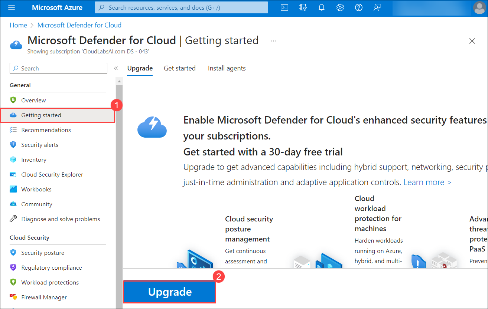

# Lab 14: Microsoft Defender for Cloud

## Lab scenario
You have been asked to create a proof of concept of Microsoft Defender for Cloud-based environment. Specifically, you want to:
- Configure Microsoft Defender for Cloud to monitor a virtual machine.
- Review Microsoft Defender for Cloud recommendations for the virtual machine.
- Implement recommendations for guest configuration and Just in time VM access. 
- Review how the Secure Score can be used to determine progress toward creating a more secure infrastructure.

 > For all the resources in this lab, we are using the **East US** region. Verify with your instructor this is the region to use for class. 

## Lab objectives
In this lab, you will complete the following exercise:
- Exercise 1: Implement Microsoft Defender for Cloud

## Architecture Diagram

# Exercise 1: Implement Microsoft Defender for Cloud

In this exercise, you will complete the following tasks:

- Task 1: Configure Microsoft Defender for Cloud
- Task 2: Review the Microsoft Defender for Cloud recommendations
- Task 3: Implement the Microsoft Defender for Cloud recommendation to enable Just in time VM Access

## Task 1: Configure Microsoft Defender for Cloud

In this task, you will on-board and configure Microsoft Defender for Cloud.

1. In the Azure portal, in the **Search resources, services, and docs** text box at the top of the Azure portal page, type **Microsoft Defender for Cloud** and press the **Enter** key.

1. On the **Microsoft Defender for Cloud \| Getting started** blade, click **Upgrade** and then click **Install agents tab** scroll down and click **Install agents**.

   >**Note**: If you see any pop-up like **Only upgrade plans with existing resources** then click on **Enable** and then perform the previous step.
   
   
      
     
1. On the **Microsoft Defender for Cloud \| Getting started** blade, in the vertical menu on the left side, in the **Management** section, click **Environment Settings**.
 
   >**Note**: If you get any pop-up you can click on **Maybe Later**

1. On the **Microsoft Defender for Cloud \| Environment Settings** blade, expand the dropdown and click the entry representing under your subscription and, on the **Settings \| Defender plans** blade, ensure that **Azure Defender** is enabled for all listed down resources. 

    >**Note**: Review all the features that are available as part of Azure Defender tier and ensure that Azure Defender turned on for each resource type. 

1. On the **Settings \| Azure Defender plans** blade, select **Enable all plans** and click **Save** to save any changes.

1. Navigate back to the **Microsoft Defender for Cloud** Home page, from the left navigation pane, under the **Settings** section click on **Workflow Automation** and  click **+ Add workflow automation**.

1. On the **Add workflow automation** blade, review the available settings and click **Cancel**.

    >**Note**: You can trigger actions based threat detection alerts and Microsoft Defender for Cloud recommendations. You can also configure an action based on Logic apps. 

    >**Note**: Microsoft Defender for Cloud provides many insights into virtual machines including system update status, OS security configurations, and endpoint protection.

1. Navigate back to the **Microsoft Defender for Cloud | Environment Settings** blade, expand your subscription, and click the entry representing the Log Analytics workspace you created in the previous lab.

1. On the **Settings \| Defender plans** blade, click on **Enable all Plans** and click  on **Save**.

## Task 2: Review the Microsoft Defender for Cloud recommendation

In this task, you will review the Microsoft Defender for Cloud recommendations. 

1. In the Azure portal, navigate back to the **Microsoft Defender for Cloud \| Overview** blade. 

1. On the **Microsoft Defender for Cloud \| Overview** blade, click on **Security posture** tile in the left navigation pane and review scores.

    >**Note**: Record the current score if it is available.

1. Navigate back to the **Microsoft Defender for Cloud \| Overview** blade, select **Assessed resources**.

    

1. On the **Inventory** blade, select the **myVM** entry.

    >**Note**: You might have to wait a few minutes and refresh the browser page for the entry to appear.
    
1. On the **Resource health** blade, on the **Recommendations** tab, review the list of recommendations for **myVM**.

## Task 3: Implement the Microsoft Defender for Cloud recommendation to enable Just in time VM Access

In this task, you will implement the Microsoft Defender for Cloud recommendation to enable Just in time VM Access on the virtual machine. 

1. In the Azure portal, navigate back to the **Microsoft Defender for Cloud \| Overview** blade, from the left navigation pane under the **Cloud Security** section select **Workload protections**.

2. On the **Workload protections** blade, scroll down to **Advanced protection** section and click on **Just-in-time- VM access** tile and, click on the **Just-in-time VM access blade**.

    >**Note**: If the VMs are not listed, navigate to **Virtual Machine** blade and click the **Configuration**, Click the **Enable the Just-in-time VMs** option       under the **Just-in-time Vm's access**. Repeat the above step to navigate back to the **Microsoft Defender for Cloud** and refresh the page, the VM will appear.

3. On the **Just in time VM access**, select **Not Configured** tab and then Select **myVM** entry.

    >**Note**: You might have to wait a few minutes before the **myVM** entry becomes available.

4. Select **Enable JIT on 1 VM**.

5. On the **JIT VM access configuration** blade, on the far right of the row referencing the port **22**, click the ellipsis button and then click **Delete**.

6. On the **JIT VM access configuration** blade, click **Save**.

    >**Note**: Monitor the progress of configuration by clicking on the **Notifications** icon in the toolbar and viewing the **Notifications** blade. 

    >**Note**: It can take some time for the implementation of recommendations in this lab to be reflected by Secure Score. Periodically check the Secure Score to determine the impact of implementing these features. 

>**Results:** You have on-boarded Microsoft Defender for Cloud and implemented virtual machine recommendations. 

>**Note**: Do not remove the resources from this lab as they are needed for the Azure Sentinel lab.

 **Congratulations** on completing the task! Now, it's time to validate it. Here are the steps:
 
 - Click Lab Validation tab located at the upper right corner of the lab guide section and navigate to the Lab Validation Page.
 - Hit the Validate button for the corresponding task. If you receive a success message, you can proceed to the next task. 
 - If not, carefully read the error message and retry the step, following the instructions in the lab guide.
 - If you need any assistance, please contact us at labs-support@spektrasystems.com. We are available 24/7 to help you out.
 
 **You have successfully completed the lab**. Please click on **Next** to start the next lab.

