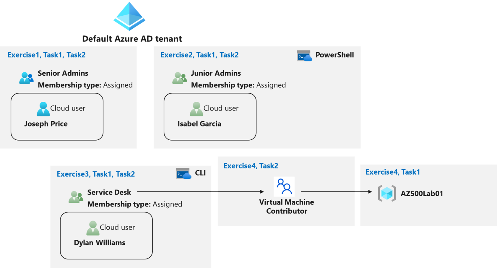
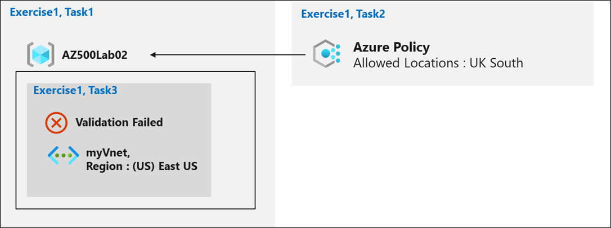
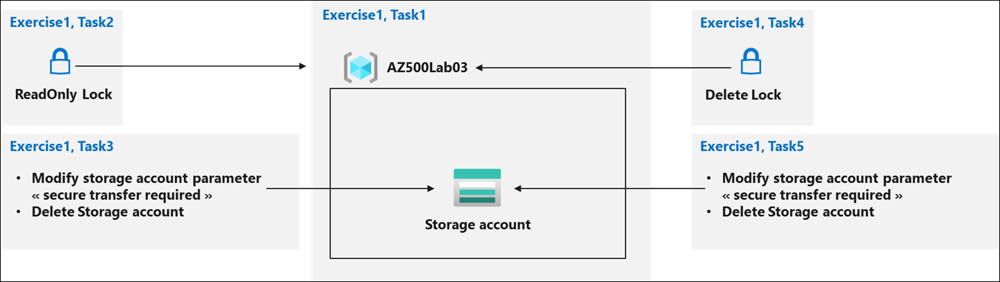

# Lab Scenario Preview: AZ-500: Manage Identity and Access - Part A

## Lab 01: Role-Based Access Control 

### Lab overview

You have been asked to create a proof of concept showing how Azure users and groups are created. Also, how role-based access control is used to assign roles to groups. Specifically, you need to:

- Create a Senior Admins group containing the user account of Joseph Price as its member.
- Create a Junior Admins group containing the user account of Isabel Garcia as its member.
- Create a Service Desk group containing the user account of Dylan Williams as its member.
- Assign the Virtual Machine Contributor role to the Service Desk group. 

### Objectives

In this lab, you will complete the following exercises

- Exercise 1: Create the Senior Admins group with the user account Joseph Price as its member (the Azure portal). 
- Exercise 2: Create the Junior Admins group with the user account Isabel Garcia as its member (PowerShell).
- Exercise 3: Create the Service Desk group with the user Dylan Williams as its member (Azure CLI). 
- Exercise 4: Assign the Virtual Machine Contributor role to the Service Desk group.

### Architecture Diagram

## Lab 02: Azure Policy

### Lab overview

You have been asked to create a proof of concept showing how Azure policy can be used. Specifically, you need to:
- Create an Allowed Locations policy that ensures resources are only created in a specific region.
- Test to ensure resources are only created in the Allowed location 

### Objectives

In this lab, you will complete the following:
- Exercise 1: Implement Azure Policy.

### Architecture Diagram

## Lab 03: Resource Manager Locks

### Lab overview

You have been asked to create a proof of concept showing how resource locks can be used to prevent accidental deletion or changes. Specifically, you need to:
- create a ReadOnly lock
- create a Delete lock
 
### Objectives
In this lab, you will complete the following exercise:
- Exercise 1: Resource Manager Locks

### Architecture Diagram

Once you understand the lab's content, you can start the Hands-on Lab by clicking the **Launch** button located in the top right corner. This will lead you to the lab environment and guide. You can also preview the full lab guide [here](https://experience.cloudlabs.ai/#/labguidepreview/c151c68e-2cc7-4e50-bc81-672aced16480) if you want to go through detailed guide prior to launching lab environment.