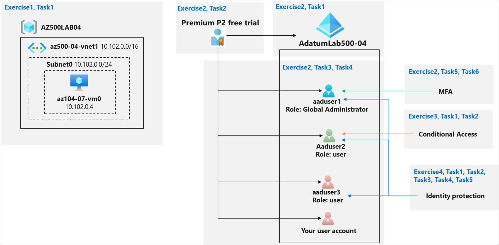
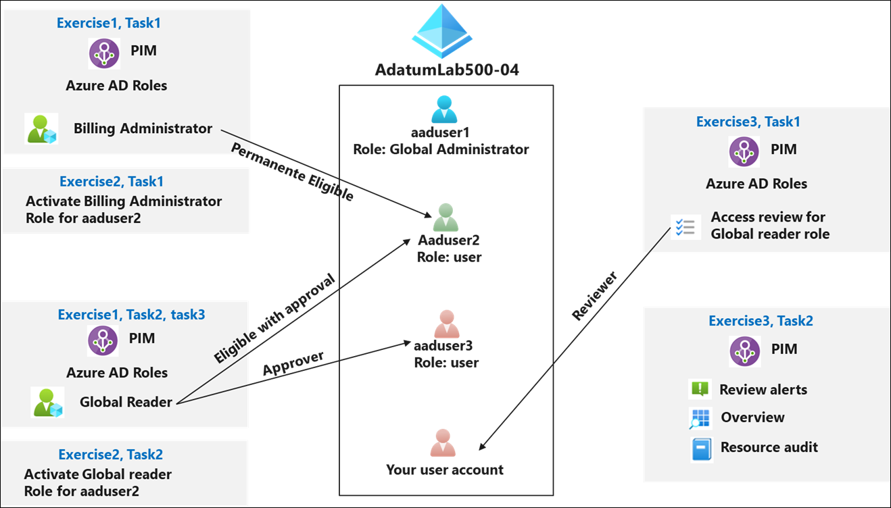
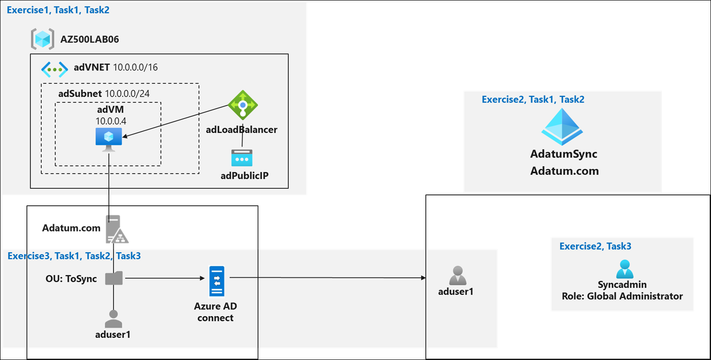

# Lab Scenario Preview: AZ-500: Manage Identity and Access - Part B

## Lab 04: MFA, Conditional Access and AAD Identity Protection

### Lab overview

You have been asked to create a proof of concept of features that enhance Azure Active Directory (Azure AD) authentication. Specifically, you want to evaluate:
- Azure AD multi-factor authentication
- Azure AD conditional access
- Azure AD Identity Protection

> For all the resources in this lab, we are using the **East US** region. Verify with your instructor this is the region to use for class. 

### Objectives

In this lab, you will complete the following exercises:
- Exercise 1: Deploy an Azure VM by using an Azure Resource Manager template
- Exercise 2: Implement Azure MFA
- Exercise 3: Implement Azure AD Conditional Access Policies 
- Exercise 4: Implement Azure AD Identity Protection

### Architecture Diagram

## Lab 05: Azure AD Privileged Identity Management

### Lab overview

You have been asked to create a proof of concept that uses Azure Privileged Identity Management (PIM) to enable just-in-time administration and control the number of users who can perform privileged operations. The specific requirements are:
- Create a permanent assignment of the aaduser2 Azure AD user to the Security Administrator role. 
- Configure the aaduser2 Azure AD user to be eligible for the Billing Administrator and Global Reader roles.
- Configure the Global Reader role activation to require an approval of the aaduser3 Azure AD user
- Configure an access review of the Global Reader role and review auditing capabilities.

> For all the resources in this lab, we are using the **East US** region. Verify with your instructor this is the region to use for class. 

> Before you proceed, ensure that you have completed Lab 04: MFA, Conditional Access and AAD Identity Protection . You will need the Azure AD tenant, AdatumLab500-04, and the aaduser1, aaduser2, and aaduser3 user accounts.

### Objectives
In this lab, you will complete the following exercises:
- Exercise 1: Configure PIM users and roles.
- Exercise 2: Activate PIM roles with and without approval.
- Exercise 3: Create an Access Review and review PIM auditing features.

### Architecture Diagram

## Lab 06: Implement Directory Synchronization

### Lab overview

You have been asked to create a proof of concept demonstrating how to integrate the on-premises Active Directory Domain Services (AD DS) environment with an Azure Active Directory (Azure AD) tenant. Specifically, you want to:
- Implement a single-domain AD DS forest by deploying an Azure VM hosting an AD DS domain controller
- Create and configure an Azure AD tenant
- Synchronize the AD DS forest with the Azure AD tenant

> For all the resources in this lab, we are using the **East US** region. Verify with your instructor this is the region to use for class. 

### Objectives
In this lab, you will complete the following exercises:
- Exercise 1: Deploy an Azure VM hosting an Active Directory domain controller
- Exercise 2: Create and configure an Azure Active Directory tenant
- Exercise 3: Synchronize Active Directory forest with an Azure Active Directory tenant

### Architecture Diagram

