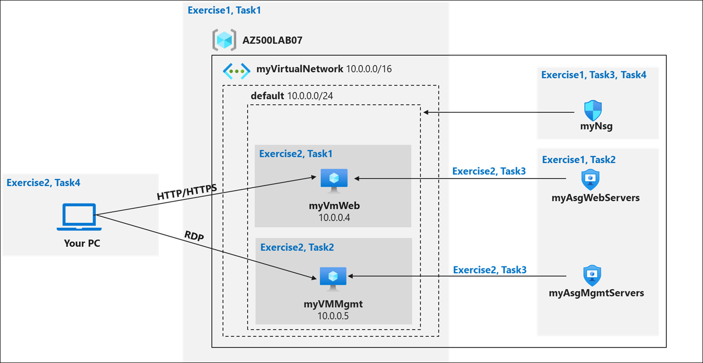
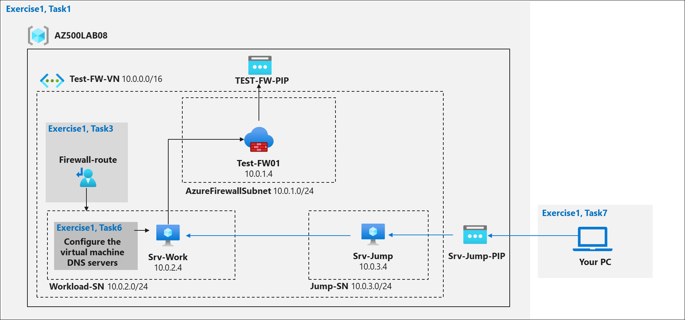
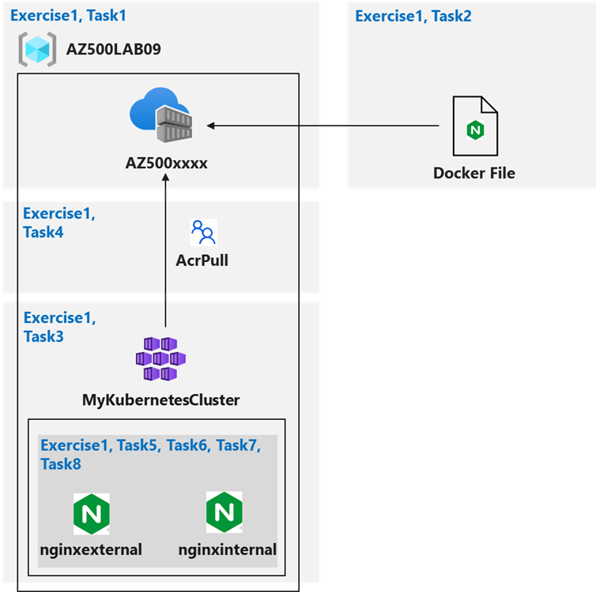

# Lab Scenario Preview: AZ-500: Implement Platform Protection

## Lab 07: Network Security Groups and Application Security Groups

### Lab overview

You have been asked to implement your organization's virtual networking infrastructure and test to ensure it is working correctly. In particular:
- The organization has two groups of servers: Web Servers and Management Servers.
- Each group of servers should be in its own Application Security Group. 
- You should be able to RDP into the Management Servers, but not the Web Servers.
- The Web Servers should display the IIS web page when accessed from the internet. 
- Network security group rules should be used to control network access. 

> For all the resources in this lab, we are using the **East US** region. Verify with your instructor this is the region to use for class. 

### Objectives

In this lab, you will complete the following exercises:
- Exercise 1: Create the virtual networking infrastructure
- Exercise 2: Deploy virtual machines and test the network filters

### Architecture Diagram

## Lab 08: Azure Firewall

### Lab overview

You have been asked to install Azure Firewall. This will help your organization control inbound and outbound network access which is an important part of an overall network security plan. Specifically, you would like to create and test the following infrastructure components:
- A virtual network with a workload subnet and a jump host subnet.
- A virtual machine is each subnet. 
- A custom route that ensures all outbound workload traffic from the workload subnet must use the firewall.
- Firewall Application rules that only allow outbound traffic to www.bing.com. 
- Firewall Network rules that allow external DNS server lookups.

> For all the resources in this lab, we are using the **East US** region. Verify with your instructor this is the region to use for class. 

### Objectives

In this lab, you will complete the following exercise:

- Exercise 1: Deploy and test an Azure Firewall

### Architecture Diagram

## Lab 09: Configuring and Securing ACR and AKS

### Lab overview

You have been asked to deploy a proof of concept with Azure Container Registry and Azure Kubernetes Service. Specifically, the proof of concept should demonstrate:
- Using Dockerfile to build an image.
- Using Azure Container Registry to store images.
- Configuring an Azure Kubernetes Service.
- Securing and accessing container applications both internally and externally. 

> For all the resources in this lab, we are using the **East US** region. Verify with your instructor this is the region to use for class. 

### Objectives

In this lab, you will complete the following exercise:
- Exercise 1: Configuring and Securing ACR and AKS

### Architecture Diagram

