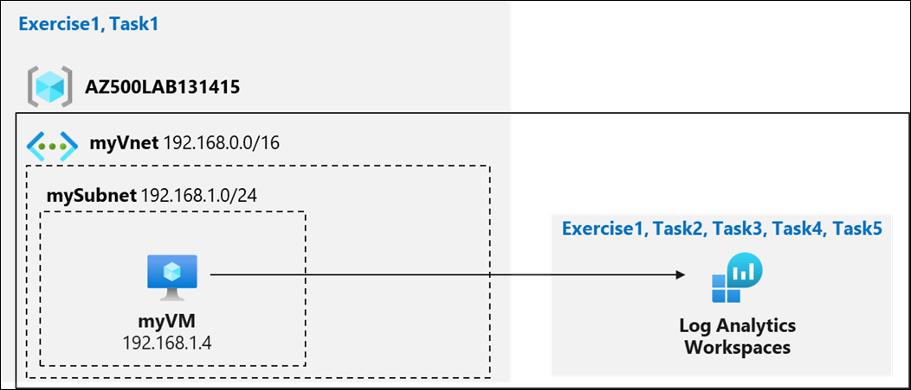
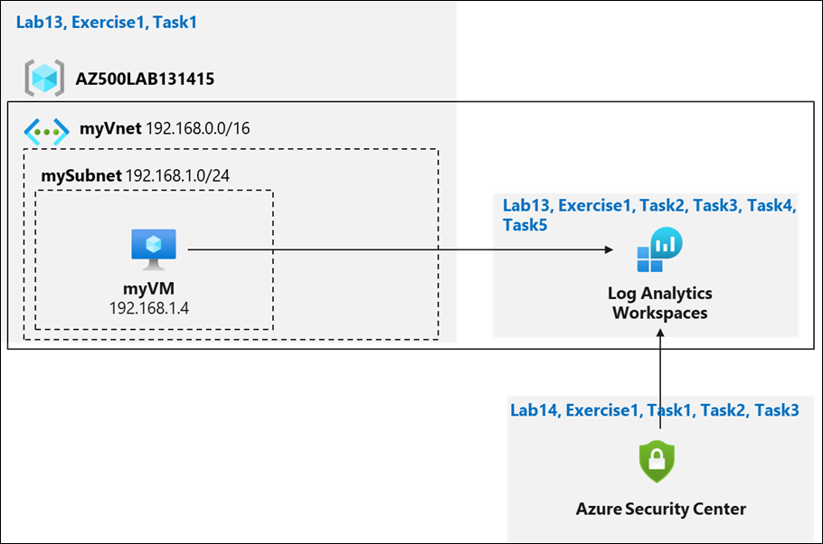
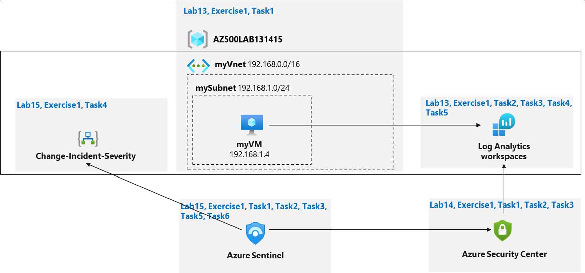

# Lab Scenario Preview: AZ-500: Manage security operations

## Lab 13: Azure Monitor

### Lab overview

You have been asked to create a proof of concept for monitoring virtual machine performance. Specifically, you want to:
- Configure a virtual machine such that telemetry and logs can be collected.
- Show what telemetry and logs can be collected.
- Show how the data can be used and queried. 

> For all the resources in this lab, we are using the **East US** region. Verify with your instructor this is the region to use for class. 

### Objectives

In this lab, you will complete the following exercise:
- Exercise 1: Collect data from an Azure virtual machine with Azure Monitor

### Architecture Diagram

## Lab 14: Microsoft Defender for Cloud

### Lab overview

You have been asked to create a proof of concept of Microsoft Defender for Cloud-based environment. Specifically, you want to:
- Configure Microsoft Defender for Cloud to monitor a virtual machine.
- Review Microsoft Defender for Cloud recommendations for the virtual machine.
- Implement recommendations for guest configuration and Just in time VM access. 
- Review how the Secure Score can be used to determine progress toward creating a more secure infrastructure.

 > For all the resources in this lab, we are using the **East US** region. Verify with your instructor this is the region to use for class. 

### Objectives

In this lab, you will complete the following exercise:
- Exercise 1: Implement Microsoft Defender for Cloud

### Architecture Diagram

## Lab 15: Microsoft Sentinel

### Lab overview

You have been asked to create a proof of concept of Microsoft Sentinel-based threat detection and response. Specifically, you want to:
- Start collecting data from Azure Activity and Security Center.
- Add built in and custom alerts 
- Review how Playbooks can be used to automate a response to an incident.

> For all the resources in this lab, we are using the **East US** region. Verify with your instructor this is the region to use for class. 

### Objectives

In this lab, you will complete the following exercise:
- Exercise 1: Implement Microsoft Sentinel

### Architecture Diagram

