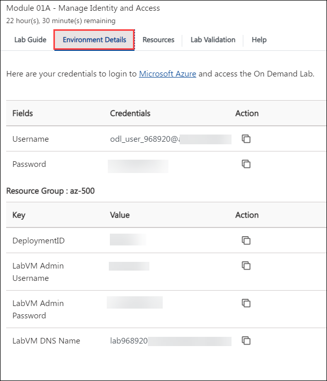
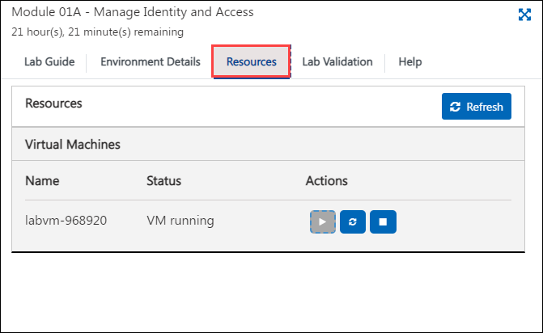
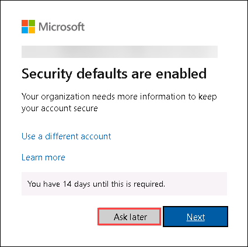

# Getting Started

1. Once the environment is provisioned, a virtual machine and lab guide will get loaded into your browser. Use this virtual machine throughout the workshop to perform the lab.

1. To get the lab environment details, you can select the **Environment Details** tab.

    

1. You can also open the Lab Guide on a separate full window by selecting the **Split Window** button on the bottom right corner.

        

1. Also, you can **start, stop and restart** the virtual machines from the **Resources** tab.

    
    
1. Click on **Next** from the bottom right and follow the instructions to perform the lab.

    

### Log in to Azure Portal and verify the pre-deployed resources.

1. In the virtual machine (VM) on the left, click on the Azure Portal as shown below.

    

1. On the **Sign in to Microsoft Azure** window, you will see the login screen, enter the following username and click on **Next**.
   * Username: <inject key="AzureAdUserEmail"></inject>

    
     
1. Now enter the password and click on Sign in.
   * Password: <inject key="AzureAdUserPassword"></inject>
  
    
    
1. If you are directed to the **Security Defaults Enabled** pop up, please click on **Ask later**    
   
   

1. First-time users are often prompted to Stay Signed In, if you see any such pop-up, click on No.

    

1. If a **Welcome to Microsoft Azure** popup window appears, click Maybe Later to skip the tour.
    
